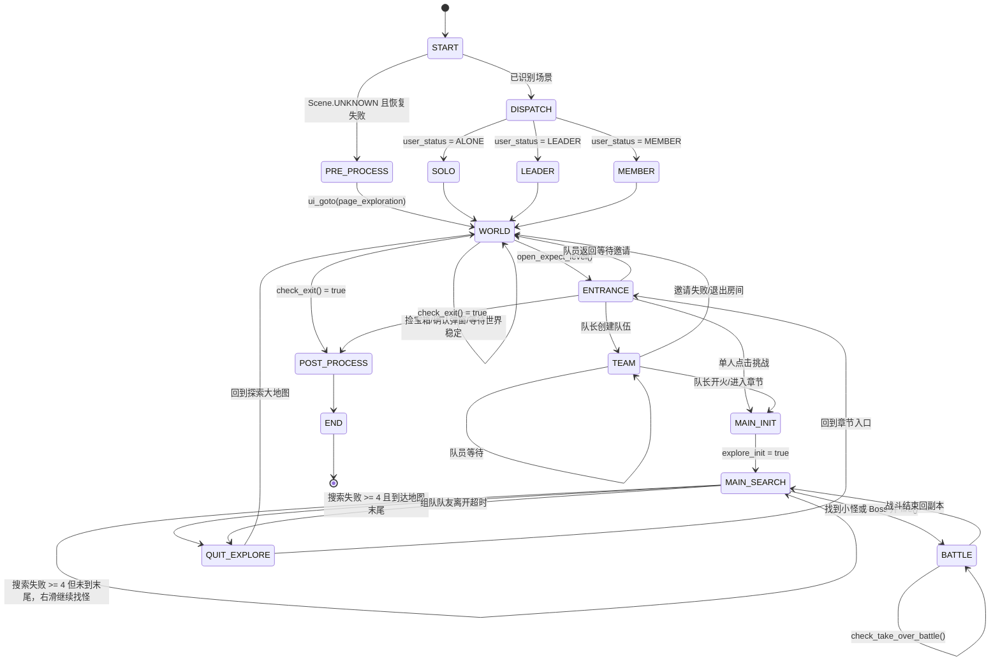
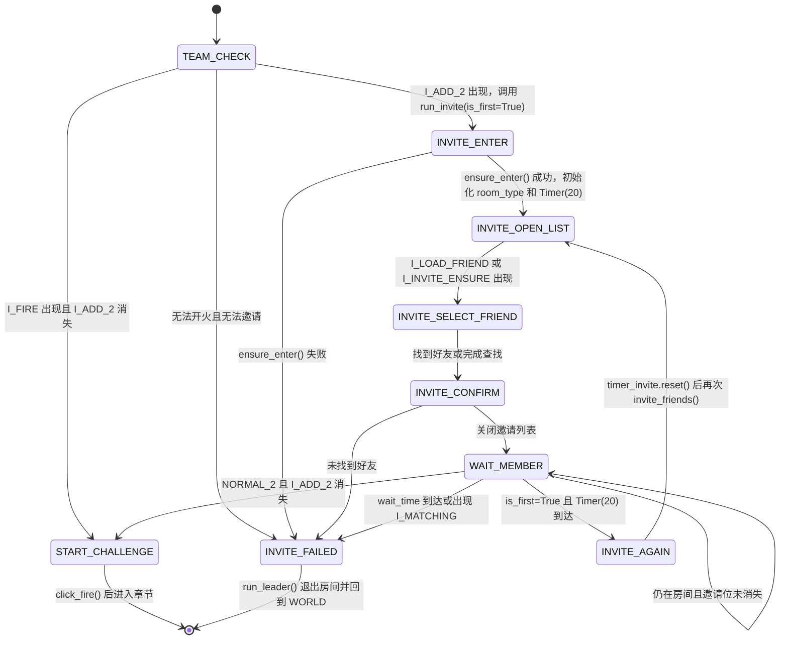

# 探索阶段转换状态机

本文档基于当前 `tasks/Exploration` 实现整理。现有代码不是独立状态机类，而是由 `Scene` 场景识别加 `run_solo`、`run_leader`、`run_member` 三个循环隐式驱动。

## 代码入口

- `tasks/Exploration/base.py`
  - `Scene`
  - `get_current_scene()`
  - `pre_process()`
  - `post_process()`
  - `check_exit()`
  - `quit_explore()`
  - `fire()`
- `tasks/Exploration/solo.py`
  - `ScriptTask.run()`
  - `run_solo()`
  - `run_leader()`
  - `run_member()`

## 状态定义

| 状态 | 含义 |
| --- | --- |
| `START` | 启动探索任务，先识别当前场景。 |
| `PRE_PROCESS` | 当前场景无法识别且随机点击恢复失败时，执行前置处理：换御魂、开加成、进入探索页。 |
| `WORLD` | 探索大地图/章节选择页。 |
| `ENTRANCE` | 章节入口弹窗/章节挑战入口。 |
| `TEAM` | 组队房间，主要由队长/队员模式使用。 |
| `MAIN_INIT` | 已进入探索副本，但本轮探索还未初始化。 |
| `MAIN_SEARCH` | 探索副本内找怪、捡小纸人、打 Boss。 |
| `BATTLE` | 战斗准备或战斗中。 |
| `QUIT_EXPLORE` | 退出当前章节，回到 `WORLD` 或 `ENTRANCE`。 |
| `POST_PROCESS` | 任务结束收尾：返回庭院、关闭加成、设置下次运行。 |
| `END` | 抛出 `TaskEnd`，结束任务。 |

## 主状态机



## 队长邀请好友子状态机

探索队长模式进入 `TEAM` 后，邀请逻辑由两段代码共同驱动：

- `tasks/Exploration/solo.py`
  - `run_leader()`：识别 `Scene.TEAM`，决定是否直接开火或进入邀请流程。
  - `invite_friend()`：探索覆盖的好友选择逻辑。
- `tasks/Component/GeneralInvite/general_invite.py`
  - `run_invite()`：通用组队等待、重复邀请、开火判断。
  - `invite_friends()`：调用具体的 `invite_friend()`。

### 子状态定义

| 状态 | 含义 |
| --- | --- |
| `TEAM_CHECK` | 队长在组队房间内检查邀请位和挑战按钮。 |
| `INVITE_ENTER` | 确认已进入组队房间，初始化房间类型和邀请定时器。 |
| `INVITE_OPEN_LIST` | 点击邀请位 `I_ADD_2`，等待好友列表加载或邀请确认按钮出现。 |
| `INVITE_SELECT_FRIEND` | 按配置的查找方式选择好友。 |
| `INVITE_CONFIRM` | 点击邀请确认按钮，关闭好友列表。 |
| `WAIT_MEMBER` | 等待队友进入房间。 |
| `INVITE_AGAIN` | 定时器到达后再次邀请。 |
| `START_CHALLENGE` | 探索双人房检测到 `I_ADD_2` 消失，点击挑战。 |
| `INVITE_FAILED` | 等待超时、房间消失或好友查找失败。 |

### 子状态图



### 当前边界风险

主等待循环可以处理队友进房：探索房间是 `RoomType.NORMAL_2`，当 `I_ADD_2` 消失时，`run_invite()` 会进入 `START_CHALLENGE` 并点击挑战。

风险在 `INVITE_OPEN_LIST` 到 `INVITE_CONFIRM` 之间。探索自己的 `invite_friend()` 在点击 `I_ADD_2` 后，只等待：

- `I_LOAD_FRIEND`
- `I_INVITE_ENSURE`
- 再次点击到 `I_ADD_2` / `I_ADD_5_4`

它没有检测“队友已进入房间导致 `I_ADD_2` 消失”的条件，也没有内部超时。因此如果第二次邀请刚触发时，队友正好进入房间，邀请列表或确认按钮又没有按预期出现，流程可能停在 `INVITE_OPEN_LIST` 或后续好友列表切换循环里，无法回到 `WAIT_MEMBER` 去触发 `START_CHALLENGE`。

## 关键转换条件

### `WORLD -> POST_PROCESS`

`check_exit()` 返回 `true`：

- `minions_cnt >= exploration_config.minions_cnt`
- 当前运行时长达到 `exploration_config.limit_time`
- 绘卷模式下突破票数量达到 `scrolls.scrolls_threshold`，当前探索结束并调度 `RealmRaid`、`MemoryScrolls`

### `WORLD -> ENTRANCE`

满足以下流程：

- `wait_world_stable()` 判定探索大地图稳定
- 若出现宝箱，先领取宝箱
- `open_expect_level()` 找到配置章节并点击

### `ENTRANCE -> MAIN_INIT`

单人模式下点击章节挑战入口 `I_E_EXPLORATION_CLICK`，进入探索副本。

### `ENTRANCE -> TEAM`

队长模式下创建队伍并确认，进入组队房间。

### `MAIN_INIT -> MAIN_SEARCH`

首次进入副本后执行初始化：

- 若 `auto_rotate = yes`，进入设置并补充候补式神
- 点击自动轮换开关
- 设置 `explore_init = true`

### `MAIN_SEARCH -> BATTLE`

找目标优先级：

1. 若出现小纸人奖励 `I_BATTLE_REWARD`，先领取。
2. 若出现 Boss 按钮 `I_BOSS_BATTLE_BUTTON`，点击开战。
3. 查找普通怪按钮，受 `up_type` 配置过滤。

`fire()` 成功后：

- 调用 `run_general_battle()`
- `minions_cnt += 1`

### `MAIN_SEARCH -> QUIT_EXPLORE`

连续找怪失败 `search_fail_cnt >= 4`，并且满足任一条件：

- 当前章节为第 28 章且出现 `I_SWIPE_END`
- `_match_end.stable()` 判定已经滑到地图末尾

组队模式下，如果队友标识消失并超过 10 秒，也会进入退出流程。

### `BATTLE -> MAIN_SEARCH`

战斗阶段由 `check_take_over_battle()` 接管。战斗结束后，下一轮截图识别回到 `MAIN` 场景，业务上继续 `MAIN_SEARCH`。

### `QUIT_EXPLORE -> WORLD/ENTRANCE`

`quit_explore()` 持续处理返回、退出确认、战斗奖励等弹窗，直到识别到：

- 探索大地图 `WORLD`
- 章节入口 `ENTRANCE`

### `UNKNOWN` 恢复

启动阶段如果识别为 `UNKNOWN`：

- 最多执行 2 次安全随机点击
- 若仍为 `UNKNOWN`，执行 `pre_process()`

运行循环中如果识别为 `UNKNOWN`，当前逻辑是继续截图重试。

## 三种运行模式差异

### 单人模式 `ALONE`

```text
WORLD -> ENTRANCE -> MAIN_INIT -> MAIN_SEARCH -> BATTLE
```

特点：

- 自己选择章节
- 自己开怪
- 达到次数、时间或绘卷条件后退出

### 队长模式 `LEADER`

```text
WORLD -> ENTRANCE -> TEAM -> MAIN_INIT -> MAIN_SEARCH -> BATTLE
```

特点：

- 创建队伍
- 邀请好友
- 负责开怪
- 副本内如果队友标识消失超过 10 秒，退出当前探索

### 队员模式 `MEMBER`

```text
WORLD -> 等待邀请 -> MAIN_INIT -> MAIN_SEARCH/BATTLE
```

特点：

- 在探索大地图等待邀请
- 不主动选择章节开怪
- 如果队友标识消失超过 10 秒，退出当前探索并回到大地图继续等待

## 可重构方向

当前代码把“画面识别状态”和“业务阶段状态”混在三个循环中。后续如果要显式化状态机，建议拆成两层：

- 画面态：沿用 `Scene`，只负责识别当前 UI 处于哪里。
- 业务态：新增 `ExplorationPhase`，表达 `MAIN_INIT`、`MAIN_SEARCH`、`QUIT_EXPLORE`、`POST_PROCESS` 等业务阶段。

这样可以减少 `run_solo`、`run_leader`、`run_member` 中重复的副本内逻辑，并把模式差异集中在进入副本前和组队异常处理上。

